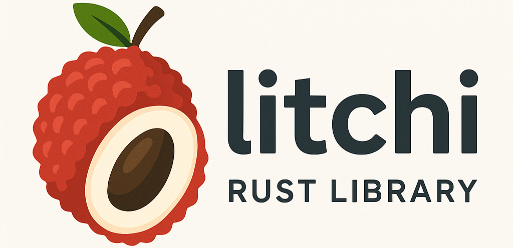

# Litchi

<p align="center">
  
</p>

A high-performance Rust library for parsing Microsoft Office file formats (OLE2 and OOXML), OpenDocument formats (ODF), and Apple iWork files. Supports .doc, .docx, .xls, .xlsx, .ppt, .pptx, .odt, .ods, .odp, .pages, .numbers, and .key files.

> [!WARNING]
> ⚠️ **Active Development**: This library is under active development. The API may change without notice. **Not recommended for production use yet.**

> [!NOTE]
> The current logo is generated by AI, we need someone to design a better logo. If you are interested, please contact me via [email](mailto:ryker.zhu@outlook.com).

## Features

- **Unified API** - Same interface for legacy and modern formats with automatic format detection
- **Microsoft Office** - Parse .doc, .docx, .xls, .xlsx, .xlsb, .ppt, .pptx files
- **OpenDocument** - Parse .odt, .ods, .odp files (ODF format)
- **Apple iWork** - Parse .pages, .numbers, .key files (IWA format)
- **Formula Conversion** - Parse MathType and Office MathML equations and convert to LaTeX
- **Markdown Conversion** - Convert documents and presentations to Markdown format
- **Memory Efficient** - Direct byte buffer support with zero-copy parsing where possible
- **High Performance** - SIMD optimizations, minimal allocations, efficient memory layout

## Quick Start

```rust
use litchi::{Document, Presentation};

// Microsoft Office formats - format auto-detected
let doc = Document::open("document.doc")?;  // .doc or .docx
let text = doc.text()?;

let pres = Presentation::open("slides.ppt")?;  // .ppt or .pptx
let slide_count = pres.slide_count()?;

// Excel spreadsheets
use litchi::sheet::open_xls_workbook;
let workbook = open_xls_workbook("spreadsheet.xls")?;
let worksheet = workbook.worksheet_by_name("Sheet1")?;

// OpenDocument formats (requires "odf" feature)
#[cfg(feature = "odf")]
{
    use litchi::odf;
    let odt = odf::Document::open("document.odt")?;
    let text = odt.text()?;
}

// Apple iWork formats (requires "iwa" feature)
#[cfg(feature = "iwa")]
{
    use litchi::iwa;
    let pages = iwa::Document::open("document.pages")?;
    let text = pages.text()?;
}

// Formula conversion (requires "formula" feature)
#[cfg(feature = "formula")]
{
    use litchi::formula;
    let latex = formula::mathml_to_latex("<math>...</math>")?;
}
```

## Installation

Add to your `Cargo.toml`:

```toml
[dependencies]
litchi = "0.0.1"
```

### Optional Features

By default, only Microsoft Office formats are enabled (`ole` and `ooxml` features). Enable additional features as needed:

```toml
[dependencies]
# Enable all features
litchi = { version = "0.0.1", features = ["odf", "iwa", "formula", "imgconv"] }

# Or enable specific features
litchi = { version = "0.0.1", features = ["odf"] }  # OpenDocument support
litchi = { version = "0.0.1", features = ["iwa"] }  # Apple iWork support
litchi = { version = "0.0.1", features = ["formula"] }  # Formula parsing and LaTeX conversion
litchi = { version = "0.0.1", features = ["imgconv"] }  # Image conversion support
```

**Available Features:**
- `ole` (default) - Legacy Office formats (.doc, .xls, .ppt)
- `ooxml` (default) - Modern Office formats (.docx, .xlsx, .pptx)
- `odf` - OpenDocument formats (.odt, .ods, .odp)
- `iwa` - Apple iWork formats (.pages, .numbers, .key)
- `formula` - MathType and Office MathML to LaTeX conversion
- `imgconv` - Image format conversion (EMF, WMF, PICT to PNG/JPEG/WebP)

## Documentation

For detailed documentation, API reference, and examples, visit [docs.rs/litchi](https://docs.rs/litchi).

## Current Status

**Implemented:**
- ✅ Microsoft Office formats (.doc, .docx, .xls, .xlsx, .xlsb, .ppt, .pptx)
- ✅ OpenDocument formats (.odt, .ods, .odp)
- ✅ Apple iWork formats (.pages, .numbers, .key)
- ✅ Text extraction and basic formatting
- ✅ Table and shape parsing
- ✅ Formula parsing (MathType and MathML to LaTeX)
- ✅ Markdown conversion

**Limitations:**
- Read-only (no document creation or modification)
- Basic formatting support only
- No formula evaluation, charts, headers/footers, embedded objects
- Missing advanced features like styles, themes, comments, revisions

See [docs.rs/litchi](https://docs.rs/litchi) for the complete roadmap and planned features.

## License

Licensed under the Apache License, Version 2.0.

## Acknowledgments

This library is built upon the work of many open-source projects. We are grateful to the following projects for their research, documentation, and reference implementations:

**Microsoft Office Formats:**
- [Apache POI](https://poi.apache.org/) - Java library for Microsoft Office formats
- [python-docx](https://github.com/python-openxml/python-docx) - Python library for DOCX files
- [python-pptx](https://github.com/scanny/python-pptx) - Python library for PPTX files
- [openpyxl](https://openpyxl.readthedocs.io/) - Python library for XLSX files
- [calamine](https://github.com/tafia/calamine) - Rust Excel/ODS reader
- [pyxlsb2](https://github.com/willtrnr/pyxlsb) - Python XLSB parser
- [xlrd](https://github.com/python-excel/xlrd) - Python library for reading Excel files

**OpenDocument Formats:**
- [odfpy](https://github.com/eea/odfpy) - Python API for OpenDocument files
- [odfdo](https://github.com/jdum/odfdo) - Modern Python library for ODF

**Apple iWork Formats:**
- [libetonyek](https://github.com/LibreOffice/libetonyek) - Library for Apple Keynote presentations
- [iWorkFileFormat](https://github.com/obriensp/iWorkFileFormat) - iWork file format documentation
- [pyiwa](https://github.com/masaccio/pyiwa) - Python iWork Archive parser

**RTF Formats:**
- [rtf2latex2e](https://github.com/wilfriedh/rtf2latex2e) - RTF to LaTeX converter
- [RtfDomParser](https://github.com/elistevens/RtfDomParser) - RTF parser

**Formula Conversion:**
- [plurimath](https://github.com/plurimath/plurimath) - Multi-format mathematical formula converter

**Image Conversion:**
- [libemf2svg](https://github.com/kakwa/libemf2svg) - EMF/WMF to SVG conversion
- [libwmf](https://github.com/caolanm/libwmf) - Windows Metafile library
- [pict2png](https://github.com/0x00000FF/pict2png) - PICT to PNG conversion

**Utilities:**
- [file](https://github.com/file/file) - File type identification (libmagic)
- [calibre](https://github.com/kovidgoyal/calibre) - E-book management and format documentation

**Specifications:**
- [Microsoft Office File Format Documentation](https://docs.microsoft.com/en-us/openspecs/office_file_formats/)

All projects retain their original licenses.
