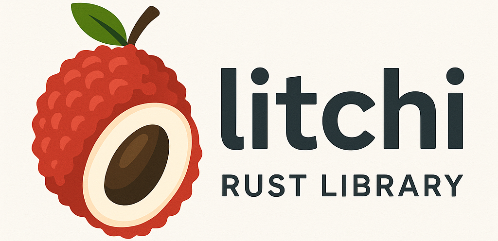

# Litchi

<p align="center">
  
</p>

A high-performance Rust library for parsing Microsoft Office file formats (OLE2 and OOXML), OpenDocument formats (ODF), and Apple iWork files. Supports .doc, .docx, .xls, .xlsx, .ppt, .pptx, .odt, .ods, .odp, .pages, .numbers, and .key files.

> [!WARNING]
> ⚠️ **Active Development**: This library is under active development. The API may change without notice. **Not recommended for production use yet.**

> [!NOTE]
> The current logo is generated by AI, we need someone to design a better logo. If you are interested, please contact me via [email](mailto:ryker.zhu@outlook.com).

## Features

- **Complete CRUD Operations** - Create, read, update, and save Office documents (.docx, .xlsx, .pptx)
- **Unified API** - Same interface for legacy and modern formats with automatic format detection
- **Microsoft Office** - Full support for .doc, .docx, .xls, .xlsx, .xlsb, .ppt, .pptx files
- **OpenDocument** - Parse .odt, .ods, .odp files (ODF format)
- **Apple iWork** - Independently parse .pages, .numbers, and .key files through dedicated format leaves
- **Formula Conversion** - Parse MathType and Office MathML equations and convert to LaTeX
- **Markdown Conversion** - Convert documents and presentations to Markdown format
- **Memory Efficient** - Direct byte buffer support with zero-copy parsing where possible
- **High Performance** - SIMD optimizations, minimal allocations, efficient memory layout

OOXML ownership is split by responsibility: `litchi-opc` owns the package graph,
`litchi-ooxml-common` owns shared OOXML vocabulary and package services,
`litchi-docx`, `litchi-pptx`, `litchi-xlsx`, and `litchi-xlsb` own their format
semantics, and `litchi-fonts` owns font discovery, subsetting, embedding, and
obfuscation. The `litchi` facade exposes each namespace only when its matching
opt-in feature is enabled.

OOXML ingestion is bounded by `litchi_opc::ReadLimits`. The standard profile is
used by ordinary open methods; applications that receive untrusted or
multi-tenant input can derive a tighter checked profile with
`ReadLimits::builder()` and pass it to the contextual DOCX, PPTX, XLSX, or XLSB
`*_with_limits` entry point. The policy covers package input, ZIP members and
metadata, materialized OPC parts, `[Content_Types].xml`, and relationship XML
and graph traversal. It implements the defensive-consumer concerns in
ECMA-376 Part 2 sections 7.3.6 and 10, together with MS-OI29500 sections
2.1.1749-1752; its ceilings are Litchi safety policy, not maxima prescribed by
those specifications.

PPTX and XLSX custom document properties use the shared typed
`litchi_ooxml_common::custom::Props` and `Value` model for parsing and writing,
following vendored `MS-OI29500` §3.11. A missing custom-properties part is an
empty `Props`; mutations are transactional and invalidate package signatures.
Property values are inert data: Litchi never executes macros, VBA, ActiveX,
controls, OLE objects, embedded code, actions, formulas, or links. Macro, VBA,
ActiveX, control, OLE, and embedded-code payloads are retained only as inert
blobs when exposed or preserved; they are never executed or activated.

## Quick Start

### Reading Documents

```rust
use litchi::{Document, Presentation};

// Microsoft Office formats - format auto-detected
let doc = Document::open("document.doc")?;  // .doc or .docx
let text = doc.text()?;

let pres = Presentation::open("slides.ppt")?;  // .ppt or .pptx
let slide_count = pres.slide_count()?;

// Excel spreadsheets
use litchi::sheet::open_xls_workbook;
let workbook = open_xls_workbook("spreadsheet.xls")?;
let worksheet = workbook.worksheet_by_name("Sheet1")?;
```

### Creating and Writing Documents

```rust
use litchi::docx::Package;
use litchi::xlsx::Workbook;
use litchi::pptx::Package as PptxPackage;

// Create Word document
let mut pkg = Package::new()?;
let doc = pkg.document_mut()?;
doc.add_heading("My Document", 1)?;
doc.add_paragraph_with_text("Hello, World!");
pkg.save("output.docx")?;

// Create Excel workbook
let mut wb = Workbook::create()?;
let ws = wb.worksheet_mut(0)?;
ws.set_cell_value(1, 1, "Hello");
ws.set_cell_value(1, 2, "World");
wb.save("output.xlsx")?;

// Create PowerPoint presentation
let mut pkg = PptxPackage::new()?;
let pres = pkg.presentation_mut()?;
let slide = pres.add_slide()?;
slide.set_title("My Presentation");
pkg.save("output.pptx")?;
```

### Additional Format Support

```rust
// OpenDocument text (requires "odt")
#[cfg(feature = "odt")]
{
    use litchi::odt::Document;
    let odt = Document::open("document.odt")?;
    let text = odt.text()?;
}

// Apple Pages documents (requires "pages")
#[cfg(feature = "pages")]
{
    use litchi::Document;
    let pages = Document::open("document.pages")?;
    let text = pages.text()?;
}

// Apple Keynote presentations (requires "keynote")
#[cfg(feature = "keynote")]
{
    use litchi::Presentation;
    let keynote = Presentation::open("slides.key")?;
    let slide_count = keynote.slide_count()?;
}

// Apple Numbers workbooks (requires "numbers")
#[cfg(feature = "numbers")]
{
    use litchi::sheet::Workbook;
    let numbers = Workbook::open("budget.numbers")?;
    let sheet_count = numbers.worksheet_count();
}

// Detect any immutable packaged iWork document once (requires "iwork")
#[cfg(feature = "iwork")]
{
    use litchi::iwork::Document;

    // `package_bytes` can be borrowed or supplied as `Arc<[u8]>`.
    let document = Document::from_bytes(package_bytes)?;
    let snapshot = document.snapshot();
    println!("{}: {}", document.format(), snapshot.summary());
    for text in snapshot.iter_text() {
        println!("{:?}: {}", text.role(), text.value());
    }
}

// Formula conversion (requires "formula" feature)
#[cfg(feature = "formula")]
{
    use litchi::formula;
    let latex = formula::mathml_to_latex("<math>...</math>")?;
}
```

## Installation

> [!NOTE]
> The library on the crates.io is just a placeholder right now (contains only read-only functionalities), if you want to use it, please use the development version.

Add to your `Cargo.toml`:

```toml
[dependencies]
litchi = { version = "0", features = ["docx"] }

# Or use the development version
litchi = { git = "https://github.com/DevExzh/litchi.git", features = ["docx"] }
```

### Optional Features

Default features are empty. Choose precisely the file formats and capabilities
your application uses; `default-features = false` is therefore optional, but
can make that intent explicit.

```toml
[dependencies]
# Legacy PowerPoint, OOXML PowerPoint, and signing support.
litchi = { version = "0", features = ["ppt", "pptx", "sign"] }

# A minimal spreadsheet reader/writer surface.
litchi = { version = "0", default-features = false, features = ["xlsx"] }

# Parse only Pages documents. `keynote` and `numbers` are independent leaves.
litchi = { version = "0", features = ["pages"] }

# Enable every iWork format as a convenience bundle.
litchi = { version = "0", features = ["iwork"] }
```

Formats never imply signing. Add `sign` only when your application needs
signature support.

**Note about iWork leaves:** `pages`, `keynote`, and `numbers` parse serialized
IWA Protocol Buffer messages. Enabling any one of them requires a system
`protoc` installation (used by `prost-build`); `iwork` simply enables all three.

- **Linux (Debian/Ubuntu)**: install `protobuf-compiler`
- **macOS**: install `protobuf` (e.g. via Homebrew)
- **Windows**: install `protobuf` (e.g. via Winget)

**Note about `fonts`:** Font embedding depends on `font-kit`, so enabling it requires a system `fontconfig` installation (used by `font-kit`).

- **Linux (Debian/Ubuntu)**: install `pkg-config libfreetype6-dev libfontconfig1-dev`

**Feature groups:**

- Format leaves: `doc`, `docx`, `ppt`, `pptx`, `xls`, `xlsx`, `xlsb`, `rtf`, `odt`, `ods`, `odp`, `pages`, `keynote`, `numbers`.
- Infrastructure: `cfb`, `ole`, `opc`, `ooxml-common`, `drawingml`, `odf-common`, `sheet`.
- Capabilities: `sign`, `encryption`, `formula`, `fonts`, `images`, `eval`, `web-functions`, `markdown`, `yaml`.
- Aggregates: `legacy`, `ooxml`, `odf`, `iwork`, `word`, `slides`, `spreadsheets`, `office`, `all-formats`, `all`.

Use leaf features for lean applications; aggregates are convenience bundles.

Legacy binary formats have independent owners: `litchi-doc`, `litchi-ppt`,
and `litchi-xls`. Their canonical umbrella modules are `litchi::doc`,
`litchi::ppt`, and `litchi::xls`. The low-level `ole` feature exposes shared
OLE vocabulary; it is not a legacy format owner or compatibility facade.

iWork follows the same ownership rule: `litchi::pages`, `litchi::keynote`, and
`litchi::numbers` expose the concrete format owners, while `Document`,
`Presentation`, and `sheet::Workbook` provide their established format-family
entry points. With the aggregate `iwork` feature, `litchi::iwork::Document`
also provides one bounded, format-neutral reader for immutable packaged Pages,
Keynote, and Numbers bytes. It exposes only root-owned semantic handles and
never native object identifiers or Protocol Buffer values. Directory bundles
remain format-specific until their frozen-source adapter lands.

## Documentation

- **[API Reference](https://docs.rs/litchi)** - Complete API documentation
- **[OFFICE_API_GUIDE.md](docs/OFFICE_API_GUIDE.md)** - Comprehensive guide with examples
- **[FEATURE_MATRIX.md](docs/FEATURE_MATRIX.md)** - Feature comparison with Apache POI
- **[Examples](examples/)** - Working code examples:
  - `office_crud_demo.rs` - Complete CRUD operations demo

## Current Status

**Fully Implemented:**
- ✅ **CRUD Operations** - Create, read, and update .docx, .xlsx, .pptx files
- ✅ **Reading** - Full support for .doc, .docx, .xls, .xlsx, .xlsb, .ppt, .pptx
- ✅ **Writing** - Document creation and modification for OOXML formats
- ✅ **Text & Formatting** - Paragraphs, runs, tables, cells, basic styling
- ✅ **OpenDocument** - Read .odt, .ods, .odp files
- ✅ **Apple iWork** - Read .pages, .numbers, .key files  
- ✅ **Formula Parsing** - MathType and MathML to LaTeX conversion
- ✅ **Markdown Export** - Convert documents and presentations to Markdown

**In Progress:**
- 🟡 Advanced formatting (cell styles, conditional formatting)
- 🟡 Charts and embedded objects
- 🟡 Headers, footers, comments
- 🟡 Document protection and security features

See [docs/FEATURE_MATRIX.md](docs/FEATURE_MATRIX.md) for a detailed feature comparison with Apache POI.

## License

Licensed under the Apache License, Version 2.0.

## Acknowledgments

This library is built upon the work of many open-source projects. We are grateful to the following projects for their research, documentation, and reference implementations:

**Microsoft Office Formats:**
- [Apache POI](https://poi.apache.org/) - Java library for Microsoft Office formats
- [python-docx](https://github.com/python-openxml/python-docx) - Python library for DOCX files
- [python-pptx](https://github.com/scanny/python-pptx) - Python library for PPTX files
- [openpyxl](https://openpyxl.readthedocs.io/) - Python library for XLSX files
- [calamine](https://github.com/tafia/calamine) - Rust Excel/ODS reader
- [pyxlsb2](https://github.com/willtrnr/pyxlsb) - Python XLSB parser
- [xlrd](https://github.com/python-excel/xlrd) - Python library for reading Excel files

**OpenDocument Formats:**
- [odfpy](https://github.com/eea/odfpy) - Python API for OpenDocument files
- [odfdo](https://github.com/jdum/odfdo) - Modern Python library for ODF

**Apple iWork Formats:**
- [libetonyek](https://github.com/LibreOffice/libetonyek) - Library for Apple Keynote presentations
- [iWorkFileFormat](https://github.com/obriensp/iWorkFileFormat) - iWork file format documentation
- [pyiwa](https://github.com/masaccio/pyiwa) - Python iWork Archive parser

**RTF Formats:**
- [rtf2latex2e](https://github.com/wilfriedh/rtf2latex2e) - RTF to LaTeX converter
- [RtfDomParser](https://github.com/elistevens/RtfDomParser) - RTF parser

**Formula Conversion:**
- [plurimath](https://github.com/plurimath/plurimath) - Multi-format mathematical formula converter

**Image Conversion:**
- [libemf2svg](https://github.com/kakwa/libemf2svg) - EMF/WMF to SVG conversion
- [libwmf](https://github.com/caolanm/libwmf) - Windows Metafile library
- [pict2png](https://github.com/0x00000FF/pict2png) - PICT to PNG conversion

**Utilities:**
- [file](https://github.com/file/file) - File type identification (libmagic)
- [calibre](https://github.com/kovidgoyal/calibre) - E-book management and format documentation

**Specifications:**
- [Microsoft Office File Format Documentation](https://docs.microsoft.com/en-us/openspecs/office_file_formats/)

All projects retain their original licenses.
