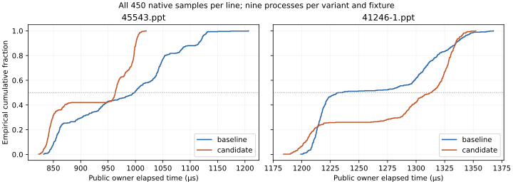

# 0735 — rejected PPT record-staging clone removal

Rejected: primary paired p50 improves 3.53%, but secondary paired p50
regresses 6.34% with eight of nine pairs above the review threshold. Allocation
work falls on both fixtures, while peak live bytes stay unchanged. Production
is restored to the baseline; candidate source and tests remain only as evidence.

Record replacement and insertion validate their input before changing editor
state. Previously they then cloned the complete private Editor, inserted the
owned record into the cloned staging map, set `changed`, and replaced the
original editor. No fallible typed work followed that clone. The candidate
inserts directly after the same validation and updates the same flag.

The source guard proves byte-identical validation prefixes: 602 bytes for
replacement and 704 for insertion. Identity checks, removed/live/staged-ID
checks, record size limits, record framing, error order and typed errors stay
unchanged. A map allocation can still abort/panic under the allocator's policy;
this change introduces no recoverable allocation guarantee. Removing clone
allocations removes their failure opportunities. It does not generalize to
mutators that have fallible work after mutation.

The editor's original source remains immutable and cheap to share. All other
editor fields retain their values, policy and limits. Finish, including the
0734 owned payload handoff, source layout adoption, bounded output, Reuse-plan
validation, PPT mapping readback, public semantic reopen, unrelated-stream and
picture preservation, and both artifact digests, is unchanged. No public API,
cache, runtime, dependency, unsafe code or ambient I/O is added.

## Evidence scope

The [packet](results/change-0735/README.md) retains fresh before captures made
before the source edit, two exact-source binaries built from identical probe
source and flags, the full workspace Rust/manifest census, source archives,
commands and logs, prospective hypothesis and schedule, raw results and replay
scripts. The baseline includes committed change 0734.

The ordinary public workflow removes live slide index one: `45543.ppt` goes
from 11 to 10 slides and `41246-1.ppt` from 36 to 35. This exercises record
replacement. Insertion receives state-transition and refusal correctness
coverage; this matrix does not measure insertion throughput or multi-record
scaling. Both fixtures require exact output and stream inventory, normalized
raw CFB directory metadata, live record/slide identity, survivor payloads, text,
list/outline data, notes and comments. The primary oracle remains anchored to
the sealed 0731/0728 reference.

Nine process pairs per case use 50 samples and three warmups, with three
allocation process pairs per case using one sample and no warmup. CPU 12 is
pinned; pairs rotate order; execution is serial. Oracle validation runs outside
the owner interval. Allocation instrumentation is a separate lane with no
latency claim. No samples or tails are discarded. Bootstrap intervals use nine
process-pair changes, 10,000 resamples, seed 7335 and percentile 95% bounds.
Within-process samples are not independent repetitions.

Before applying the candidate, source fields predict a lower bound of 695,275
primary and 329,614 secondary payload bytes copied by the whole-editor clone:
all source stream vectors plus the separate Document and Current User vectors.
Path/map/vector metadata is additional. This bound is a source-derived
hypothesis, not itself a measurement or native-cost attribution.

## Results and rejection

All 48 processes and 1,812 measured owner outputs pass the exact oracle and
independent audit. No observation is discarded or selectively repeated.

| Metric | `45543.ppt` | `41246-1.ppt` |
| --- | ---: | ---: |
| Baseline process p50 range | 994.210–1,002.575 µs | 1,223.181–1,265.251 µs |
| Candidate process p50 range | 960.890–964.774 µs | 1,303.972–1,315.422 µs |
| Median paired p50 change | −3.53% | **+6.34%** |
| Paired p50 bootstrap 95% interval | [−3.75%, −3.14%] | **[+5.40%, +6.61%]** |
| Median paired mean change | −5.29% | +1.85% |
| Paired mean bootstrap 95% interval | [−5.52%, −5.04%] | [+1.68%, +2.04%] |
| Allocated bytes, before → candidate | 11,391,768 → 10,695,353 | 10,444,631 → 10,113,357 |
| Allocation calls, before → candidate | 5,658 → 5,631 | 18,662 → 18,630 |
| Peak live bytes | 1,992,885 unchanged | 1,976,223 unchanged |
| Retained output bytes | 390,144 unchanged | 285,184 unchanged |

Every allocation repeat agrees exactly per case and variant. Allocated bytes
fall 696,415 (6.11%) and 331,274 (3.17%), while calls fall 27 and 32. These
exceed the prospective payload lower bounds by 1,140 and 1,660 bytes,
consistent with additional cloned metadata; those residuals are not separately
attributed by stack traces. Peak live and retained output bytes do not improve.

Every primary p50 and mean pair improves. Primary p95, p99 and maximum improve
by more than 5% in all nine pairs, and eight mean improvements exceed 5%.
Every secondary p50 and mean pair regresses. Eight secondary p50 pairs exceed
5%; the remaining pair is +3.77%. No secondary mean or tail flag exceeds 5%.
[All signed flags and ranges](results/change-0735/report-stats.txt) are retained.
With 50 samples, nearest-rank p99 equals the maximum and is not an independent
tail observation.

The curves pool 450 owner samples per line for visualization only. Statistical
intervals use the nine independent process pairs. The curves cross and contain
multiple concentration bands; the source of that behavior is unproven. This
packet does not establish an allocator, cache, executable-layout or probe-oracle
cadence explanation.

The consistent secondary median regression outweighs the allocation-work
reduction without a peak-memory benefit. Reject the unconditional optimization,
restore the entire production module to its baseline bytes, and retain the
candidate and evidence. Do not introduce fixture-dependent behavior or choose
only favorable observations. Next qualify native-phase and allocator-lifecycle/
oracle-cadence controls on the secondary before retrying this staging change.
Correctness validation remains mandatory. Insertion and multi-record workloads
need their own performance evidence.

## Correctness and ADR constraints

The candidate passes twelve final serial gates: seven owner checks and five
probe checks. Owner tests pass 1,216 with three ignored; doctests pass 14 with
eight ignored; probe tests pass four for each binary build. Clippy and rustdoc
deny warnings, and the crate-boundary audit passes 64 packages and 241 internal
dependencies with 11 existing debt items. The first synthetic preflight catches
a review-receipt field-name mismatch; its exact inputs and failure remain
archived. The corrected second preflight passes before any comparative capture.

Focused tests preserve every Editor field on invalid IDs, removed/staged IDs,
short, truncated, trailing and oversized record refusals. Valid sequential
replacement/insertion is compared with the former clone-based transition,
including unrelated staged records. A real fixture compares finished replacement
bytes with the clone reference.

| Constraint | Evidence |
| --- | --- |
| ADR 0001/0002/0024 layers and topology | One private PPT mutation module; no public API or dependency changes. |
| ADR 0003 snapshots and atomic publication | Checks precede mutation; input source stays immutable; outer commit publication is untouched. |
| ADR 0005 budgets and performance | Same record/output limits; fresh ordinary latency and allocation comparisons; no allocation-abort recovery claim. |
| ADR 0006/0026 validation and preservation | Typed validation prefixes and downstream validators stay unchanged; exact stream, directory and semantic oracles retained. |
| ADR 0008 verification | Source archives, exact build custody and fresh affected-owner/probe gates. |
| ADR 0010/0011 archive ownership | CFB ownership remains below the format boundary; no physical-package types escape. |

Scope remains one public operation, two warm fixtures and one recorded host.
Peak live bytes are boundary-relative allocator ownership, not RSS. No cold-I/O,
instruction, concurrency, broad-producer or broad-CRUD claim follows. The wider
non-iWork performance goal remains active.

All 19 evidence-corruption controls are rejected by both validators, before
and after binary cleanup. The full production source census is restored to
the fresh baseline and is byte-identical to the accepted 0734 candidate census.
The baseline probe gates are fresh; the unchanged production owner gates are
reused from 0734 by exact source identity. No new owner build is claimed after
reversion. Candidate-bound validation is replayed in an isolated archived-source
root after first checking the real workspace remains at that baseline.

The post-reversion isolated replay passes both frozen validators and the source
guard, reproduces the retained analysis exactly, and preserves all 97 capture
files and all 7,206 production source files. `rejected-replay.json` and its raw
log record the result. The temporary replay root, owned build target and four
measurement binaries are removed.

Whitespace checking excludes the byte-preserved raw logs `build-0/1.log`,
`build-1/1.log`, `quality-0/2.log` (terminal blank lines), and the generated
`native-distributions.svg` (Matplotlib path whitespace). All other staged
files pass the whitespace check.
