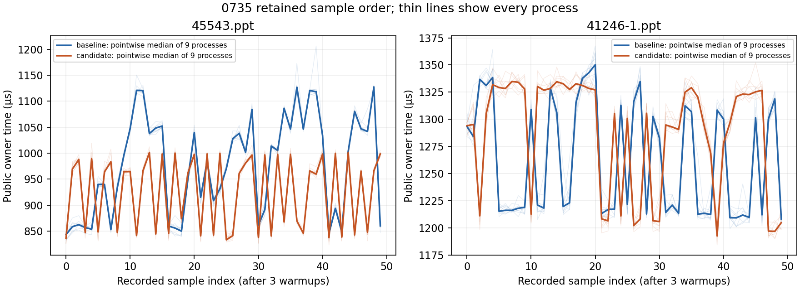

# 0736 — qualify the PPT measurement lifecycle on both fixtures

The rejected 0735 candidate stays rejected. A post-hoc analysis of its sealed
1,800 native samples finds repeatable sample-position dependence on **both**
fixtures. In particular, the primary baseline's final ten samples have a p50
15.89–19.53% higher than its first ten in every process. This changes the next
experiment: qualify the probe's oracle and retained-witness lifecycle on both
fixtures before attributing the secondary regression or retrying clone removal.

Production remains byte-identical to the accepted baseline across 7,206 source
files. This batch runs no new Rust build or native measurement and makes no
new production performance claim. It adds a reproducible analysis, source
lifecycle audit, independent numerical check and controlled follow-up design.

## Evidence and method

[The packet](results/change-0736/README.md) binds the exact 0735 artifact seal,
checks all its file sizes and hashes, and reads all 36 native processes: nine
baseline/candidate pairs per fixture, 50 samples after three warmups. No sample
is omitted. The full-window p50 and mean reproduce 0735's paired medians to
floating-point tolerance. Process pairs remain the units of comparison.

Six overlapping windows are descriptive, post-hoc sensitivity checks; they are
not six independent experiments or new retention gates. p50 uses the midpoint
median, matching 0735. Each table cell is the median of nine paired percentage
changes, `(candidate / baseline - 1) × 100`. No multiplicity-adjusted inference
or new confidence interval is claimed.

| Sample indices, inclusive | Primary p50 change | Secondary p50 change |
| --- | ---: | ---: |
| 0–49, original full window | −3.53% | +6.34% |
| 0–9 | +11.97% | +5.80% |
| 10–39 | −6.72% | +3.57% |
| 40–49 | −5.09% | +7.47% |
| 0–24 | +2.96% | +3.25% |
| 25–49 | −6.90% | +5.78% |

All nine primary pairs regress by more than 5% in the first-ten window; all
nine improve by more than 5% in the middle-thirty window. Every secondary
pair remains positive in every reported window. These descriptive flags remain
in the machine-readable result alongside the original full-window flags.

The primary result changes sign across windows. That is evidence against
treating its 50 observations as interchangeable draws from a stable per-process
distribution. It does not identify an allocator or cache mechanism.

Thin lines preserve every process's sample order. Thick lines are pointwise
medians of nine processes, not a real process trajectory or confidence band.
Repeated bands occur at similar positions across processes; chronological
sample order contains information that the earlier pooled ECDF does not show.

| Within-process final-ten / first-ten p50 change | Median of nine | Range |
| --- | ---: | ---: |
| Primary baseline | +18.35% | +15.89% to +19.53% |
| Primary candidate | +0.25% | −0.41% to +1.19% |
| Secondary baseline | −2.78% | −3.81% to −2.09% |
| Secondary candidate | −1.25% | −2.25% to −0.96% |

Process-order stratification also preserves the secondary regression: its
full-window paired median is +5.64% when baseline executes first (four pairs)
and +6.61% when candidate executes first (five pairs). Primary medians are
−3.24% (five baseline-first pairs) and −3.64% (four candidate-first pairs).
These small, unbalanced descriptive groups do not isolate time or execution
order causally, but the regression is not confined to one order.

## Source-grounded lifecycle

The sealed probe's `timed_format` measures the public edit and returns its output.
The public operation includes its mandatory validation; none is removed.
`output_sample` subsequently hashes and inventories the output and runs the
full external preservation oracle. It returns a `Sample` containing a digest,
inventory summary and oracle witness; `samples.push` retains those values for
the rest of the process. The witness includes live-record bytes and semantic
values marked `serde(skip)`, so the JSON does not expose all retained payloads. The output vector itself is consumed and dropped
outside the timed interval. See the detailed [lifecycle audit](results/change-0736/lifecycle.md).

Warmup iterations instead drop each result without invoking `output_sample`.
Consequently, three owner warmups do not exercise the same between-iteration
allocation and retention path as the measured loop. This is a source fact,
not proof that it caused the observed performance differences. Moving checks
outside a timer excludes their direct duration but does not reset allocator,
cache or retained-state effects before the next timed edit.

For scale only, compact JSON serialization of the 50 retained samples totals
about 1.02 MB on the primary and 2.74 MB on the secondary. These are serialized
evidence sizes, **not** heap measurements, peak live bytes or RSS. They cannot
be subtracted from the allocation lane or used to explain the regression.

## Decision and next measurement

Keep the original full-window rejection and allocation findings unchanged.
Do not choose a favorable window, increase warmups after seeing results, or
restore the rejected candidate on the strength of this analysis. The native
regression's cause is still unknown.

Before another optimization trial, compare the unchanged accepted owner under
the exact existing harness and controls that separately address warmup cadence,
retained witness lifetime and external-oracle placement. Every measured output
must still receive the same complete byte, directory and semantic oracle;
deferred checks require explicitly bounded output retention and separate memory
accounting. Preserve the original lane as a control. Record all sample orders,
randomize/rotate processes prospectively, and use independent process pairs.
Only then reintroduce the archived candidate for a newly frozen comparison.
The lifecycle audit specifies the confounders and the required control arms.

No architectural change is made. ADR 0003 atomic publication, ADR 0005 honest
performance boundaries, ADR 0006 preservation and validation, ADR 0008 evidence
custody and ADR 0024 ownership remain intact. All 34 recorded goal, scenario and
ADR constraint hashes match 0735; no new owner gate is claimed from this
analysis-only batch. The broader non-iWork goal remains active.

The separately implemented audit agrees on all 532 shared statistics within
1e-10; analysis and plot regeneration are byte-identical. The evidence packet
is sealed with an exact artifact inventory. No build target or binary was
created, and no temporary scratch or Python caches remain in the packet.
