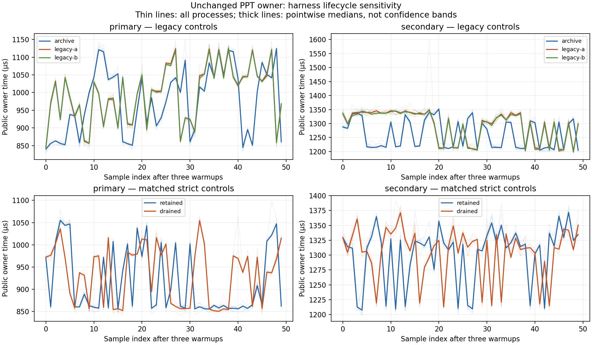

# 0737 — PPT lifecycle controls expose an unqualified legacy observer

The new lifecycle probe is retained as a diagnostic facility, but its timings
are **not interchangeable with the original probe**. With production unchanged,
the revised legacy arm raises secondary p50 by 6.67%, with all nine process
pairs above 5%. The duplicate legacy A/A control is small on both fixtures.
The rejected 0735 optimization remains rejected and is not run in this batch.

Matched retained/drained witness controls show substantial primary sensitivity:
draining increases paired p50 by 10.10%, while the secondary p50 difference is
inconclusive. Drained first-ten versus last-ten medians are close, but repeated
sample-position bands remain. A near-zero endpoint contrast does not establish
stationarity or an allocator/cache cause.

## Setup and preservation

[The sealed packet](results/change-0737/README.md) starts at `0fd5c67a62` and
binds all 7,206 accepted production source files, both qualified fixtures,
the 34 goal/scenario/ADR constraint hashes, toolchain, CPU and environment,
two exact probe builds, commands, source snapshots, and raw output/stderr.
The original 0735 probe is rebuilt as an independent legacy anchor. No
production code, limits, preservation policy or public owner operation changes.

Both probes execute the public PPT open/edit/commit operation that removes
slide position one. The primary is `45543.ppt` (11 to 10 slides), and the
secondary is `41246-1.ppt` (36 to 35). Output bytes, complete stream inventories,
normalized raw CFB directory metadata, live records, survivors, text, outlines,
list data, notes and comments match the sealed 0735 contract. Each process
retains all eight rejected corruption controls.

The prospective CPU-12-pinned serial matrix contains 108 native processes:
90 with 50 samples and three warmups, plus 18 one-sample fresh-process controls.
Thirty separate allocation processes use one measured sample and zero or
three warmups. Arm order rotates in nine native rounds per fixture and three
allocation rounds. All **4,518 native samples**, 30 measured allocation records,
and 198 strict warmup receipts pass the exact oracle. Twenty additional fresh
qualification runs precede the frozen matrix; their timings are not pooled.

| Arm | Measured lifecycle |
| --- | --- |
| archive | Independently rebuilt original 0735 probe; owner-only warmups and full witnesses retained after measured samples. |
| legacy-a / legacy-b | Identical revised binary and arguments under two labels; same owner-only warmup policy, extended receipt metadata. |
| retained | Full oracle on warmups and measured outputs; compact receipts retained; measured full witnesses also retained. |
| drained | Same oracle and receipt path, same reserved witness-buffer capacity; full witnesses dropped after validation. |
| fresh | Drained arm with one sample per child; nine processes per fixture, no tail comparison. |

Both strict arms drop full warmup witnesses before the next operation and keep
the same visible warmup receipts. Actual witness counts are recorded: retained
and revised legacy accumulate 1 through 50, drained remains zero. These counts
describe ownership, not bytes. Compact JSON values still accumulate in strict
arms. Payloads marked `serde(skip)` are validated by the source-audited full
oracle before being dropped; JSON cannot reconstruct their heap ownership.

The revised legacy schema and `Sample` layout differ from the original. The
legacy-to-retained comparison also changes warmup validation and compact
receipt construction together. Neither contrast isolates a single cause.
Fresh controls additionally reserve capacity for one sample rather than 50,
so they do not isolate process lifetime from initial buffer layout.

## Native results

Each percentage is the median of nine paired process-level percentage changes.
p50 uses the midpoint median; tails use nearest rank. Brackets contain a
10,000-resample paired-median bootstrap interval, seed 7337. Within-process
samples are not independent process repetitions. Intervals are descriptive
per contrast and metric, with no multiple-comparison adjustment.

| Fixture | Comparison | p50 change and 95% interval | Mean change | p95 change | p99/max change |
| --- | --- | ---: | ---: | ---: | ---: |
| Primary | archive → legacy-a | +0.72% [+0.36, +1.27] | +1.88% | −0.04% | +0.00% |
| Primary | legacy-a → legacy-b | +0.11% [−0.12, +0.22] | +0.01% | +0.04% | −0.36% |
| Primary | legacy-a → retained | −14.00% [−14.26, −13.53] | −7.92% | −6.69% | −6.75% |
| Primary | retained → drained | +10.10% [+9.77, +10.43] | +1.90% | −2.10% | −0.04% |
| Secondary | archive → legacy-a | +6.67% [+5.90, +7.49] | +2.52% | +0.53% | −0.11% |
| Secondary | legacy-a → legacy-b | −0.13% [−0.42, +0.28] | −0.06% | −0.26% | +0.46% |
| Secondary | legacy-a → retained | +0.33% [+0.01, +0.60] | +0.79% | +1.27% | +1.53% |
| Secondary | retained → drained | −0.31% [−0.48, +0.07] | +0.16% | −0.68% | +0.06% |

For absolute scale, medians across the nine per-process p50 values are:

| Arm | Primary µs | Secondary µs |
| --- | ---: | ---: |
| archive | 997.75 | 1,230.73 |
| legacy-a | 1,006.53 | 1,314.24 |
| legacy-b | 1,005.86 | 1,313.17 |
| retained | 865.24 | 1,319.31 |
| drained | 953.71 | 1,314.61 |
| fresh, one sample per child | 970.67 | 1,331.12 |

These absolute medians are not the estimator used for paired percentages.
The table does not imply any production speedup.

All >5% flags are retained in `analysis.json` and `summary.txt`:

- Primary legacy-to-retained: all nine p50, mean and p95 pairs improve by more
  than 5%; seven p99/max pairs do so. These are harness sensitivity flags.
- Primary retained-to-drained: all nine p50 pairs regress, range +9.75–10.57%.
- Secondary archive-to-legacy: all nine p50 pairs regress, range +5.76–7.64%.
- Secondary repeat six has an archive-to-legacy p99/max flag of +17.96%.
  The same legacy-a process produces −15.52% in the A/A contrast and −14.36%
  in legacy-to-retained. These shared-reference flags are not three independent
  outlier events. No cause is assigned and the sample is not discarded.
- No other full-window native comparison exceeds the absolute 5% threshold.
  With 50 samples, nearest-rank p99 equals maximum, so these are duplicate
  views of the same observation, not independent tail evidence.

## Sample order and allocations

The plot retains all 90 fifty-sample processes. Thin lines are actual runs;
thick lines are pointwise medians, not confidence bands. Endpoint drift is the
per-process last-ten p50 relative to first-ten p50, summarized across nine runs:

| Arm | Primary median drift | Secondary median drift |
| --- | ---: | ---: |
| archive | +18.92% | −3.27% |
| legacy-a | +10.07% | −9.08% |
| legacy-b | +9.86% | −8.82% |
| retained | −6.66% | +0.70% |
| drained | +0.10% | −0.11% |

Drained ranges are −0.21% to +0.51% on primary and −1.00% to +0.64% on secondary.
The plot still shows repeatable interior bands. The original full window
remains the comparison gate; no favorable subset replaces it.

All five owner allocation fields are exactly identical across every arm,
warmup level and repeat for a given fixture:

| Fixture | Allocated bytes | Allocation calls | Peak live bytes | Retained bytes |
| --- | ---: | ---: | ---: | ---: |
| Primary | 11,391,768 | 5,658 | 1,992,885 | 390,144 |
| Secondary | 10,444,631 | 18,662 | 1,976,223 | 285,184 |

Deallocated bytes are 11,001,624 and 10,159,447, respectively. These counters
cover the owner region and exclude oracle work, receipt construction and
previous witnesses. They establish no equality of full-process heap usage,
RSS, allocator state, cache state or memory placement.

## Verification, decision and next step

Each final probe build passes format, release library tests, warning-denied
Clippy, warning-denied rustdoc and release binary build. Original probe tests
pass four; revised tests pass eight. The first revised attempt fails Clippy
on a test-only default-box expression; it is preserved, corrected and rerun.
A documentation-only rebuild corrects the legacy-schema claim, with the prior
receipt and removed binary identities retained. No owner test run is claimed
for this unchanged-production batch.

Before real capture, a synthetic 138-process preflight passes both validators
and confirms that the independent audit rejects a modified derived statistic.
Seventeen report-corruption controls cover exact oracles, warmup and measured
schemas, timing/allocation fields, retention counts and lifecycle. The real
analyzer and independent statistical audit agree on the complete matrix.

Retain the probe as a diagnostic enabler and keep the old probe as an explicit
anchor. Do not infer ordinary-owner performance or retry the production
candidate from the revised harness alone. Next isolate the legacy observer:
preserve the original `Sample` layout and serialization path while keeping
lifecycle metadata outside that retained object, then repeat the original
versus revised legacy control before a newly frozen candidate comparison.
This is a prospective hypothesis, not an established cause of either this
observer effect or the 0735 regression. Do not remove correctness checks,
select sample windows, or add fixture-specific production behavior.

ADR 0003 publication, ADR 0005 measurement boundaries and explicit execution,
ADR 0006 preservation/security, ADR 0008 evidence and ADR 0024 ownership remain
unchanged. The probe is an isolated workspace, with no production dependency
or runtime change. Native and allocator instrumentation remain separate;
there is no cold-I/O, concurrency, RSS, broad-corpus or general speedup claim.
The broader non-iWork goal remains active.

The owned build target and four exact measurement binaries are removed. Both
validators and all 17 report-corruption controls pass again after cleanup.
The exact production source census remains unchanged. `cleanup.json` and
`terminal.json` bind this final state; the packet is sealed for committed
file-inventory and byte verification.

Whitespace checking preserves terminal blank lines in the four raw test logs
`build-0/1.log` through `build-3/1.log`; all other staged files pass. These logs
are kept byte-for-byte because their hashes bind the build evidence.
