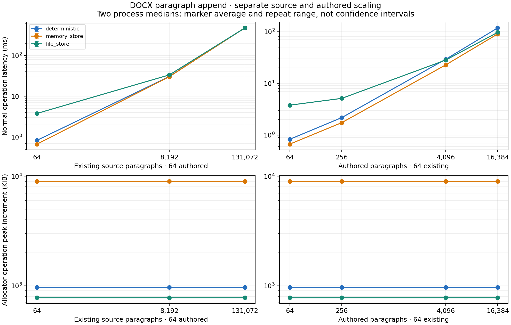

# DOCX replay route and input-profile measurements

This table covers all 228 formal child processes and 6,840 measured operations.
Each row pairs one normal process with its separate allocator process for the
same workload/profile/repeat. The 114 pilots are excluded. Two process repeats
provide descriptive repeat spread, not a confidence interval or proof of a
historical optimization speedup. The full performance goal remains open.

Latency percentiles come from 30 normal-build samples. Heap increment is the
median of each allocator sample's region peak minus its starting live bytes;
requested bytes and calls are allocator medians. RSS is one whole-normal-child
GNU time maximum, including fixture setup and report work. It is not an
operation-only memory measurement. Tail percentiles are descriptive with this
sample count. Allocation requests are not physical memory-copy counts.

The source and authored axes are varied separately. Input files are prepared
and fingerprinted before timing; cache eviction is not performed. File replay
uses explicit data sync and same-operation page-cache participation. These
measurements do not establish cold-cache or atomic-save performance.

## Replay routes

| Workload | Profile | Repeat | p50 ms | p95 ms | p99 ms | Operation heap increment KiB | Requested allocation KiB | Allocation calls | Process RSS MiB |
| --- | --- | ---: | ---: | ---: | ---: | ---: | ---: | ---: | ---: |
| s131072-a64-short-c64 | deterministic | 1 | 476.4378 | 478.5199 | 478.9728 | 966.006 | 3974.440 | 822 | 72.012 |
| s131072-a64-short-c64 | deterministic | 2 | 478.2414 | 481.0541 | 482.9797 | 966.006 | 3974.440 | 822 | 71.965 |
| s131072-a64-short-c64 | file_store | 1 | 476.3481 | 480.3718 | 481.2839 | 777.110 | 3219.298 | 823 | 79.562 |
| s131072-a64-short-c64 | file_store | 2 | 474.9701 | 478.2979 | 479.7387 | 777.110 | 3219.298 | 823 | 79.555 |
| s131072-a64-short-c64 | memory_store | 1 | 478.7988 | 481.1078 | 481.2636 | 8968.881 | 11410.292 | 819 | 78.344 |
| s131072-a64-short-c64 | memory_store | 2 | 479.4318 | 482.5458 | 483.4345 | 8968.881 | 11410.292 | 819 | 78.117 |
| s64-a16384-short-c64 | deterministic | 1 | 118.7829 | 119.8454 | 120.0330 | 966.006 | 12134.440 | 131382 | 16.938 |
| s64-a16384-short-c64 | deterministic | 2 | 116.9863 | 117.6391 | 117.7986 | 966.006 | 12134.440 | 131382 | 16.887 |
| s64-a16384-short-c64 | file_store | 1 | 96.7111 | 97.3020 | 97.5037 | 777.108 | 11379.290 | 131383 | 19.551 |
| s64-a16384-short-c64 | file_store | 2 | 97.0781 | 97.7199 | 97.8532 | 777.108 | 11379.290 | 131383 | 19.652 |
| s64-a16384-short-c64 | memory_store | 1 | 90.2971 | 90.6915 | 90.9054 | 8968.881 | 19570.292 | 131379 | 19.531 |
| s64-a16384-short-c64 | memory_store | 2 | 90.1941 | 90.7823 | 91.0941 | 8968.881 | 19570.292 | 131379 | 19.547 |
| s64-a256-short-c64 | deterministic | 1 | 2.1820 | 2.2074 | 2.2172 | 966.006 | 4070.440 | 2358 | 6.391 |
| s64-a256-short-c64 | deterministic | 2 | 2.1797 | 2.1986 | 2.2270 | 966.006 | 4070.440 | 2358 | 6.359 |
| s64-a256-short-c64 | file_store | 1 | 5.1939 | 5.3269 | 5.3443 | 777.104 | 3315.274 | 2359 | 6.246 |
| s64-a256-short-c64 | file_store | 2 | 5.0676 | 5.3038 | 5.4518 | 777.104 | 3315.274 | 2359 | 6.469 |
| s64-a256-short-c64 | memory_store | 1 | 1.7471 | 1.7579 | 1.7608 | 8968.881 | 11506.292 | 2355 | 6.617 |
| s64-a256-short-c64 | memory_store | 2 | 1.7377 | 1.7542 | 1.7619 | 8968.881 | 11506.292 | 2355 | 6.637 |
| s64-a4096-short-c64 | deterministic | 1 | 29.2075 | 29.4359 | 29.4776 | 966.006 | 5990.440 | 33078 | 8.266 |
| s64-a4096-short-c64 | deterministic | 2 | 29.3029 | 29.6947 | 29.7815 | 966.006 | 5990.440 | 33078 | 8.168 |
| s64-a4096-short-c64 | file_store | 1 | 28.3464 | 29.3788 | 30.3024 | 777.106 | 5235.282 | 33079 | 9.180 |
| s64-a4096-short-c64 | file_store | 2 | 28.1147 | 28.6756 | 32.4117 | 777.106 | 5235.282 | 33079 | 8.902 |
| s64-a4096-short-c64 | memory_store | 1 | 22.7228 | 22.9460 | 22.9797 | 8968.881 | 13426.292 | 33075 | 9.238 |
| s64-a4096-short-c64 | memory_store | 2 | 22.7642 | 23.0482 | 23.1581 | 8968.881 | 13426.292 | 33075 | 8.824 |
| s64-a64-empty-c64 | deterministic | 1 | 0.6194 | 0.6259 | 0.6286 | 966.006 | 3974.440 | 822 | 6.262 |
| s64-a64-empty-c64 | deterministic | 2 | 0.6214 | 0.6295 | 0.6323 | 966.006 | 3974.440 | 822 | 6.367 |
| s64-a64-empty-c64 | file_store | 1 | 3.7078 | 4.3897 | 4.6084 | 777.103 | 3219.267 | 823 | 6.223 |
| s64-a64-empty-c64 | file_store | 2 | 3.5541 | 3.6490 | 3.7034 | 777.103 | 3219.267 | 823 | 6.266 |
| s64-a64-empty-c64 | memory_store | 1 | 0.5583 | 0.5664 | 0.5675 | 8968.881 | 11410.292 | 819 | 6.453 |
| s64-a64-empty-c64 | memory_store | 2 | 0.5619 | 0.5695 | 0.5704 | 8968.881 | 11410.292 | 819 | 6.426 |
| s64-a64-near-c64 | deterministic | 1 | 466.4226 | 471.9831 | 473.7696 | 1085.927 | 4693.966 | 822 | 35.445 |
| s64-a64-near-c64 | deterministic | 2 | 460.4741 | 462.1382 | 464.1127 | 1085.927 | 4693.966 | 822 | 35.246 |
| s64-a64-near-c64 | file_store | 1 | 349.9448 | 352.4218 | 353.3046 | 897.021 | 3938.784 | 823 | 41.938 |
| s64-a64-near-c64 | file_store | 2 | 349.7958 | 353.1033 | 357.2476 | 897.021 | 3938.784 | 823 | 41.957 |
| s64-a64-near-c64 | memory_store | 1 | 343.2253 | 345.1513 | 346.0407 | 9088.802 | 12129.817 | 819 | 41.867 |
| s64-a64-near-c64 | memory_store | 2 | 342.9509 | 344.1885 | 344.5013 | 9088.802 | 12129.817 | 819 | 41.820 |
| s64-a64-near-cone | deterministic | 1 | 435.1739 | 437.4071 | 440.7626 | 1679.927 | 7663.966 | 822 | 35.402 |
| s64-a64-near-cone | deterministic | 2 | 432.9941 | 437.4332 | 437.8916 | 1679.927 | 7663.966 | 822 | 35.406 |
| s64-a64-near-cone | file_store | 1 | 346.4777 | 348.9406 | 349.2575 | 897.023 | 4532.792 | 823 | 42.305 |
| s64-a64-near-cone | file_store | 2 | 347.9533 | 353.3004 | 353.3861 | 897.023 | 4532.792 | 823 | 42.082 |
| s64-a64-near-cone | memory_store | 1 | 340.2261 | 343.0421 | 343.4478 | 9088.802 | 12723.817 | 819 | 41.797 |
| s64-a64-near-cone | memory_store | 2 | 337.7309 | 340.4860 | 341.3954 | 9088.802 | 12723.817 | 819 | 42.195 |
| s64-a64-near-cwindow | deterministic | 1 | 433.9377 | 435.8247 | 435.8574 | 1085.927 | 4693.966 | 822 | 35.398 |
| s64-a64-near-cwindow | deterministic | 2 | 431.7972 | 434.4557 | 435.2811 | 1085.927 | 4693.966 | 822 | 35.328 |
| s64-a64-near-cwindow | file_store | 1 | 345.8024 | 348.5081 | 349.3475 | 897.029 | 3938.815 | 823 | 42.195 |
| s64-a64-near-cwindow | file_store | 2 | 346.0578 | 352.5693 | 355.2854 | 897.029 | 3938.815 | 823 | 42.039 |
| s64-a64-near-cwindow | memory_store | 1 | 338.7369 | 339.9353 | 340.2474 | 9088.802 | 12129.817 | 819 | 41.820 |
| s64-a64-near-cwindow | memory_store | 2 | 341.0135 | 342.4482 | 343.0545 | 9088.802 | 12129.817 | 819 | 41.809 |
| s64-a64-short-c64 | deterministic | 1 | 0.7964 | 0.8044 | 0.8083 | 966.006 | 3974.440 | 822 | 6.262 |
| s64-a64-short-c64 | deterministic | 2 | 0.8668 | 0.9224 | 0.9271 | 966.006 | 3974.440 | 822 | 6.191 |
| s64-a64-short-c64 | file_store | 1 | 3.7929 | 4.5841 | 4.7548 | 777.103 | 3219.267 | 823 | 6.367 |
| s64-a64-short-c64 | file_store | 2 | 3.7973 | 4.6812 | 5.0323 | 777.103 | 3219.267 | 823 | 6.078 |
| s64-a64-short-c64 | memory_store | 1 | 0.6688 | 0.6816 | 0.6846 | 8968.881 | 11410.292 | 819 | 6.578 |
| s64-a64-short-c64 | memory_store | 2 | 0.6717 | 0.6782 | 0.6805 | 8968.881 | 11410.292 | 819 | 6.762 |
| s8192-a64-short-c64 | deterministic | 1 | 30.5717 | 30.8359 | 31.0049 | 966.006 | 3974.440 | 822 | 9.812 |
| s8192-a64-short-c64 | deterministic | 2 | 30.5640 | 30.9622 | 30.9704 | 966.006 | 3974.440 | 822 | 9.516 |
| s8192-a64-short-c64 | file_store | 1 | 33.5210 | 34.8154 | 34.9935 | 777.106 | 3219.282 | 823 | 9.910 |
| s8192-a64-short-c64 | file_store | 2 | 33.3807 | 34.1619 | 34.6517 | 777.106 | 3219.282 | 823 | 10.016 |
| s8192-a64-short-c64 | memory_store | 1 | 30.4044 | 30.8815 | 30.9673 | 8968.881 | 11410.292 | 819 | 9.926 |
| s8192-a64-short-c64 | memory_store | 2 | 30.1352 | 30.5229 | 30.6081 | 8968.881 | 11410.292 | 819 | 10.137 |

## Input, sink and compression profiles

| Workload | Profile | Repeat | p50 ms | p95 ms | p99 ms | Operation heap increment KiB | Requested allocation KiB | Allocation calls | Process RSS MiB |
| --- | --- | ---: | ---: | ---: | ---: | ---: | ---: | ---: | ---: |
| s131072-a64-short-c64 | axis-compression-current-s131072-a64-short-c64 | 1 | 478.5947 | 482.3551 | 482.9600 | 966.006 | 3974.440 | 822 | 71.828 |
| s131072-a64-short-c64 | axis-compression-current-s131072-a64-short-c64 | 2 | 476.2083 | 478.4237 | 480.1002 | 966.006 | 3974.440 | 822 | 72.000 |
| s131072-a64-short-c64 | axis-compression-deflate-s131072-a64-short-c64 | 1 | 476.2493 | 479.1513 | 480.5631 | 966.006 | 3974.440 | 822 | 72.516 |
| s131072-a64-short-c64 | axis-compression-deflate-s131072-a64-short-c64 | 2 | 484.0379 | 486.5528 | 487.1580 | 966.006 | 3974.440 | 822 | 72.523 |
| s131072-a64-short-c64 | axis-compression-store-s131072-a64-short-c64 | 1 | 504.2829 | 507.2592 | 507.3742 | 516.443 | 2761.565 | 808 | 117.359 |
| s131072-a64-short-c64 | axis-compression-store-s131072-a64-short-c64 | 2 | 506.7274 | 509.4191 | 510.6696 | 516.443 | 2761.565 | 808 | 117.379 |
| s131072-a64-short-c64 | axis-input-file-s131072-a64-short-c64 | 1 | 520.0295 | 521.6316 | 521.9072 | 965.982 | 3974.417 | 822 | 71.848 |
| s131072-a64-short-c64 | axis-input-file-s131072-a64-short-c64 | 2 | 478.1392 | 480.9351 | 482.8359 | 965.982 | 3974.417 | 822 | 72.020 |
| s131072-a64-short-c64 | axis-input-latency-s131072-a64-short-c64 | 1 | 524.7526 | 527.3347 | 527.6904 | 966.092 | 3974.526 | 823 | 71.965 |
| s131072-a64-short-c64 | axis-input-latency-s131072-a64-short-c64 | 2 | 524.7067 | 528.0891 | 528.9900 | 966.092 | 3974.526 | 823 | 71.836 |
| s131072-a64-short-c64 | axis-input-short-read-s131072-a64-short-c64 | 1 | 476.5597 | 478.5712 | 479.7029 | 966.092 | 3974.526 | 823 | 71.797 |
| s131072-a64-short-c64 | axis-input-short-read-s131072-a64-short-c64 | 2 | 477.5559 | 481.7565 | 482.9590 | 966.092 | 3974.526 | 823 | 71.777 |
| s131072-a64-short-c64 | axis-sink-4096-s131072-a64-short-c64 | 1 | 477.8471 | 479.4816 | 479.8439 | 966.006 | 3974.440 | 822 | 72.125 |
| s131072-a64-short-c64 | axis-sink-4096-s131072-a64-short-c64 | 2 | 478.0087 | 480.1085 | 484.8256 | 966.006 | 3974.440 | 822 | 71.840 |
| s131072-a64-short-c64 | axis-sink-512-s131072-a64-short-c64 | 1 | 479.8075 | 482.2318 | 482.5543 | 966.006 | 3974.440 | 822 | 71.793 |
| s131072-a64-short-c64 | axis-sink-512-s131072-a64-short-c64 | 2 | 479.9978 | 487.7708 | 490.9156 | 966.006 | 3974.440 | 822 | 72.141 |
| s131072-a64-short-c64 | axis-sink-65536-s131072-a64-short-c64 | 1 | 478.8962 | 480.9910 | 481.3731 | 966.006 | 3974.440 | 822 | 72.004 |
| s131072-a64-short-c64 | axis-sink-65536-s131072-a64-short-c64 | 2 | 479.4968 | 482.8378 | 483.2032 | 966.006 | 3974.440 | 822 | 71.836 |
| s64-a16384-short-c64 | axis-compression-current-s64-a16384-short-c64 | 1 | 116.9644 | 117.7610 | 117.9338 | 966.006 | 12134.440 | 131382 | 16.953 |
| s64-a16384-short-c64 | axis-compression-current-s64-a16384-short-c64 | 2 | 118.3639 | 119.1103 | 119.6945 | 966.006 | 12134.440 | 131382 | 17.016 |
| s64-a16384-short-c64 | axis-compression-deflate-s64-a16384-short-c64 | 1 | 117.9888 | 119.0846 | 119.1499 | 966.006 | 12134.440 | 131382 | 17.035 |
| s64-a16384-short-c64 | axis-compression-deflate-s64-a16384-short-c64 | 2 | 116.5312 | 117.0699 | 117.1993 | 966.006 | 12134.440 | 131382 | 17.047 |
| s64-a16384-short-c64 | axis-compression-store-s64-a16384-short-c64 | 1 | 125.8485 | 127.3866 | 127.6573 | 516.443 | 10921.565 | 131368 | 24.965 |
| s64-a16384-short-c64 | axis-compression-store-s64-a16384-short-c64 | 2 | 126.0366 | 127.4412 | 127.7395 | 516.443 | 10921.565 | 131368 | 24.996 |
| s64-a16384-short-c64 | axis-input-file-s64-a16384-short-c64 | 1 | 443.8589 | 446.2981 | 447.4040 | 965.982 | 12134.417 | 131382 | 17.016 |
| s64-a16384-short-c64 | axis-input-file-s64-a16384-short-c64 | 2 | 439.9780 | 441.3121 | 442.2376 | 965.982 | 12134.417 | 131382 | 16.820 |
| s64-a16384-short-c64 | axis-input-latency-s64-a16384-short-c64 | 1 | 129.0271 | 129.6625 | 129.8293 | 966.092 | 12134.526 | 131383 | 16.758 |
| s64-a16384-short-c64 | axis-input-latency-s64-a16384-short-c64 | 2 | 129.8102 | 133.5454 | 133.7888 | 966.092 | 12134.526 | 131383 | 16.793 |
| s64-a16384-short-c64 | axis-input-short-read-s64-a16384-short-c64 | 1 | 117.9034 | 119.4833 | 119.5069 | 966.092 | 12134.526 | 131383 | 16.777 |
| s64-a16384-short-c64 | axis-input-short-read-s64-a16384-short-c64 | 2 | 117.7735 | 118.2130 | 118.4256 | 966.092 | 12134.526 | 131383 | 16.863 |
| s64-a16384-short-c64 | axis-sink-4096-s64-a16384-short-c64 | 1 | 116.9077 | 117.4452 | 117.5684 | 966.006 | 12134.440 | 131382 | 16.941 |
| s64-a16384-short-c64 | axis-sink-4096-s64-a16384-short-c64 | 2 | 117.5154 | 119.1660 | 119.9065 | 966.006 | 12134.440 | 131382 | 16.902 |
| s64-a16384-short-c64 | axis-sink-512-s64-a16384-short-c64 | 1 | 116.7478 | 117.7163 | 117.9251 | 966.006 | 12134.440 | 131382 | 16.809 |
| s64-a16384-short-c64 | axis-sink-512-s64-a16384-short-c64 | 2 | 117.6391 | 118.4612 | 118.6698 | 966.006 | 12134.440 | 131382 | 16.785 |
| s64-a16384-short-c64 | axis-sink-65536-s64-a16384-short-c64 | 1 | 117.0440 | 117.4711 | 118.2121 | 966.006 | 12134.440 | 131382 | 16.859 |
| s64-a16384-short-c64 | axis-sink-65536-s64-a16384-short-c64 | 2 | 116.4835 | 117.2532 | 117.2863 | 966.006 | 12134.440 | 131382 | 16.762 |
| s64-a64-short-c64 | axis-compression-current-s64-a64-short-c64 | 1 | 0.8818 | 0.8899 | 0.8916 | 966.006 | 3974.440 | 822 | 6.340 |
| s64-a64-short-c64 | axis-compression-current-s64-a64-short-c64 | 2 | 0.8006 | 0.8100 | 0.8121 | 966.006 | 3974.440 | 822 | 6.168 |
| s64-a64-short-c64 | axis-compression-deflate-s64-a64-short-c64 | 1 | 0.9089 | 0.9159 | 0.9187 | 966.006 | 3974.440 | 822 | 6.293 |
| s64-a64-short-c64 | axis-compression-deflate-s64-a64-short-c64 | 2 | 0.7932 | 0.7998 | 0.8042 | 966.006 | 3974.440 | 822 | 6.332 |
| s64-a64-short-c64 | axis-compression-store-s64-a64-short-c64 | 1 | 0.8186 | 0.8249 | 0.8268 | 516.443 | 2761.565 | 808 | 5.656 |
| s64-a64-short-c64 | axis-compression-store-s64-a64-short-c64 | 2 | 0.8050 | 0.8138 | 0.8152 | 516.443 | 2761.565 | 808 | 5.766 |
| s64-a64-short-c64 | axis-input-file-s64-a64-short-c64 | 1 | 2.2093 | 2.2481 | 2.2581 | 965.982 | 3974.417 | 822 | 6.539 |
| s64-a64-short-c64 | axis-input-file-s64-a64-short-c64 | 2 | 2.1160 | 2.1254 | 2.1299 | 965.982 | 3974.417 | 822 | 6.336 |
| s64-a64-short-c64 | axis-input-latency-s64-a64-short-c64 | 1 | 12.4343 | 12.4526 | 12.4544 | 966.092 | 3974.526 | 823 | 6.328 |
| s64-a64-short-c64 | axis-input-latency-s64-a64-short-c64 | 2 | 12.4265 | 12.4493 | 12.8755 | 966.092 | 3974.526 | 823 | 6.223 |
| s64-a64-short-c64 | axis-input-short-read-s64-a64-short-c64 | 1 | 0.8078 | 0.8217 | 0.8260 | 966.092 | 3974.526 | 823 | 6.078 |
| s64-a64-short-c64 | axis-input-short-read-s64-a64-short-c64 | 2 | 0.9163 | 0.9294 | 0.9399 | 966.092 | 3974.526 | 823 | 6.137 |
| s64-a64-short-c64 | axis-sink-4096-s64-a64-short-c64 | 1 | 0.8821 | 0.8916 | 0.8992 | 966.006 | 3974.440 | 822 | 6.355 |
| s64-a64-short-c64 | axis-sink-4096-s64-a64-short-c64 | 2 | 0.7929 | 0.8018 | 0.8063 | 966.006 | 3974.440 | 822 | 6.227 |
| s64-a64-short-c64 | axis-sink-512-s64-a64-short-c64 | 1 | 0.7962 | 0.8025 | 0.8029 | 966.006 | 3974.440 | 822 | 6.266 |
| s64-a64-short-c64 | axis-sink-512-s64-a64-short-c64 | 2 | 0.7966 | 0.8066 | 0.8096 | 966.006 | 3974.440 | 822 | 6.102 |
| s64-a64-short-c64 | axis-sink-65536-s64-a64-short-c64 | 1 | 0.7965 | 0.8035 | 0.8047 | 966.006 | 3974.440 | 822 | 6.160 |
| s64-a64-short-c64 | axis-sink-65536-s64-a64-short-c64 | 2 | 0.7987 | 0.8084 | 0.8112 | 966.006 | 3974.440 | 822 | 6.250 |

[Complete CSV](measurements.csv) also includes source and authored throughput. The machine-readable verified summary retains individual repeat statistics, detailed counters, comparison flags and input identities. Changes above 5% trigger review; favorable and adverse differences remain visible individually.
