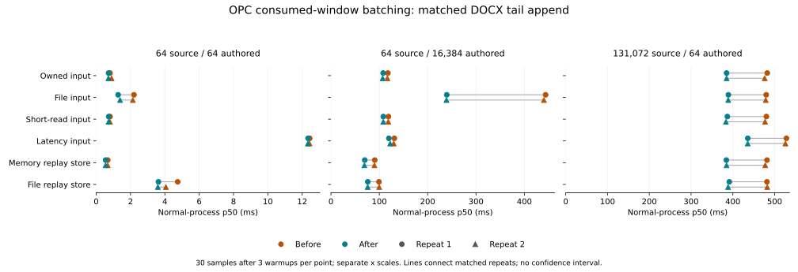

# Results and regression review

The 18-arm matched comparison completed 144 formal processes and 4,320
samples. All 72 pilots also passed and are excluded from formal statistics.
The two builds differ only in `crates/litchi-opc/src/source_backed/splice.rs`.
Every candidate archive has identical bytes across the compared builds;
source, authored content, decoded XML, semantic and preservation checks pass.

## Normal-process latency

Each table cell shows R1 / R2 independently. Times are milliseconds; changes
are signed percentages, with lower values favorable. Both repeats have 30
samples after three warmups. Full p95/p99, raw samples, instrumented metrics,
and one-observation RSS values are in [the full tables](comparison-summary.md)
and [JSON](comparison-summary.json).

| Workload | Route / input | Before p50 ms (R1 / R2) | After p50 ms (R1 / R2) | Change % (R1 / R2) |
|---|---|---:|---:|---:|
| s64-a64-short-c64 | deterministic / owned | 0.807 / 0.896 | 0.721 / 0.714 | -10.67 / -20.35 |
| s64-a64-short-c64 | deterministic / file | 2.201 / 2.135 | 1.279 / 1.389 | -41.91 / -34.93 |
| s64-a64-short-c64 | deterministic / short-read | 0.808 / 0.803 | 0.729 / 0.720 | -9.88 / -10.38 |
| s64-a64-short-c64 | deterministic / latency | 12.436 / 12.428 | 12.342 / 12.331 | -0.75 / -0.78 |
| s64-a16384-short-c64 | deterministic / owned | 117.792 / 116.774 | 107.907 / 106.849 | -8.39 / -8.50 |
| s64-a16384-short-c64 | deterministic / file | 443.916 / 440.383 | 239.499 / 238.865 | -46.05 / -45.76 |
| s64-a16384-short-c64 | deterministic / short-read | 118.917 / 118.567 | 108.296 / 108.199 | -8.93 / -8.74 |
| s64-a16384-short-c64 | deterministic / latency | 131.074 / 129.866 | 119.803 / 122.461 | -8.60 / -5.70 |
| s131072-a64-short-c64 | deterministic / owned | 482.325 / 476.215 | 385.058 / 385.006 | -20.17 / -19.15 |
| s131072-a64-short-c64 | deterministic / file | 479.811 / 478.710 | 389.321 / 388.864 | -18.86 / -18.77 |
| s131072-a64-short-c64 | deterministic / short-read | 480.252 / 477.118 | 386.893 / 383.405 | -19.44 / -19.64 |
| s131072-a64-short-c64 | deterministic / latency | 528.228 / 525.851 | 435.678 / 435.496 | -17.52 / -17.18 |
| s64-a64-short-c64 | memory_store / owned | 0.674 / 0.672 | 0.549 / 0.549 | -18.53 / -18.32 |
| s64-a16384-short-c64 | memory_store / owned | 90.551 / 89.934 | 69.909 / 69.195 | -22.80 / -23.06 |
| s131072-a64-short-c64 | memory_store / owned | 481.751 / 477.529 | 384.396 / 384.855 | -20.21 / -19.41 |
| s64-a64-short-c64 | file_store / owned | 4.747 / 4.060 | 3.626 / 3.594 | -23.61 / -11.47 |
| s64-a16384-short-c64 | file_store / owned | 99.298 / 99.754 | 76.174 / 75.916 | -23.29 / -23.90 |
| s131072-a64-short-c64 | file_store / owned | 481.673 / 482.333 | 391.463 / 388.556 | -18.73 / -19.44 |

All 36 normal p50 comparisons are lower, ranging from 0.75% to 46.05%.
The authored-heavy file input improves by 45.76–46.05%; owned input improves
by about 8.4%. Authored-heavy memory/file replay stores improve by about
23–24%. The source-heavy owned case improves by 19.15–20.17%. These are
observations for this machine, corpus, build, warm-cache policy, and scenario;
they do not establish an order-of-magnitude program-wide improvement.

## Adverse tails and RSS

The five-percent review threshold flags the following adverse latency
quantiles. Instrumented latency remains separate from normal latency.

| Role | Arm | Repeat | Quantile | Before ms | After ms | Change % |
|---|---|---:|---|---:|---:|---:|
| allocator | deterministic-latency-s64-a64-short-c64 | 1 | p95 | 12.945 | 14.531 | +12.25 |
| allocator | deterministic-latency-s64-a64-short-c64 | 1 | p99 | 25.515 | 27.668 | +8.44 |
| normal | deterministic-latency-s64-a16384-short-c64 | 2 | p99 | 131.251 | 139.944 | +6.62 |

These injected-latency tails remain adverse observations. Two process repeats
and point host-load observations do not identify their cause, so they are
not dismissed as noise or hidden by the lower medians.

Nine matched whole-child RSS observations exceed the five-percent adverse
threshold, all on the small workload. Each row below is one GNU-time maximum
per process (`n=1`), not three distinct percentile observations.

| Role | Arm | Repeat | Before bytes | After bytes | Change % |
|---|---|---:|---:|---:|---:|
| allocator | deterministic-owned-s64-a64-short-c64 | 1 | 6569984 | 6914048 | +5.24 |
| allocator | deterministic-owned-s64-a64-short-c64 | 2 | 6639616 | 7036928 | +5.98 |
| normal | deterministic-short-read-s64-a64-short-c64 | 2 | 6377472 | 7036928 | +10.34 |
| allocator | deterministic-latency-s64-a64-short-c64 | 2 | 6356992 | 6975488 | +9.73 |
| normal | memory_store-owned-s64-a64-short-c64 | 1 | 6651904 | 7184384 | +8.00 |
| normal | memory_store-owned-s64-a64-short-c64 | 2 | 6823936 | 7294976 | +6.90 |
| allocator | memory_store-owned-s64-a64-short-c64 | 1 | 6807552 | 7561216 | +11.07 |
| allocator | memory_store-owned-s64-a64-short-c64 | 2 | 6606848 | 7036928 | +6.51 |
| allocator | file_store-owned-s64-a64-short-c64 | 1 | 6144000 | 6602752 | +7.47 |

The RSS increases range from 5.24% to 11.07%. They remain a recorded tradeoff;
operation heap measurements cannot explain whole-process residency changes.
The current evidence supports accepting the scoped latency improvement with
these open tail/RSS concerns, not claiming that every metric improved.

## Heap, logical I/O, and profiles

Deterministic operation peak increments remain 989,190 bytes, and memory-store
increments remain 9,184,134 bytes. File-store peaks differ by only two bytes;
allocated-byte totals differ by eight bytes. The before/after file-store
reference paths differ by two bytes, so these tiny deltas are not credited to
the optimization. Allocation and reallocation call counts are unchanged.
Logical source reads and authored-provider counters are identical across
matched samples. File-store replay counters also match, except for the
expected durable-reference path length and hash differences.

The authored-heavy file operation still makes 60 logical reads returning
7,651 bytes. The source-heavy file operation still makes 125 reads returning
2,400,454 bytes. Metadata calls are separate from those logical reads.

The [12-child profile summary](profiles/profiles1-summary.md) retains matched
whole-child CPU observations and comparisons against the frozen 0484
metadata traces. Authored-heavy file `statx` calls fall from 3,735,939 to
1,475,055 (60.52% lower), while `pread64` stays at 114. Source-heavy file
`statx` rises from 15,415 to 25,219 (63.60% higher), with `pread64` unchanged
at 264. Owned controls remain at 12 `statx` calls. Added source fences around
external callbacks are consistent with the source-heavy increase; this
profile does not attribute every call to a stack.

Whole-child instructions fall by 32.78% for authored-heavy file input,
10.57% for authored-heavy owned input, and about 15.7–15.9% for source-heavy
input. These one-sample/one-warmup diagnostics include setup and oracle work;
they are not operation-only instruction counts or formal latency samples.
Substantial metadata and replay/audit work remains. Further caller-level
profiling should precede any additional optimization; source freshness policy
and the separate source XML proof must remain intact.

## Evidence limits

CPU 2 pinning and the coordinator lock do not reserve the entire host.
Compiler activity was visible in the before-start and after-finish point
observations; none appeared in the two middle observations. Load averages
also changed. The retained two-repeat distributions provide descriptive
results, without a strong confidence interval or a host-exclusivity claim.
Cold-cache, concurrency, broad provider/input intersections, and native
Microsoft Office certification remain outside this batch.
