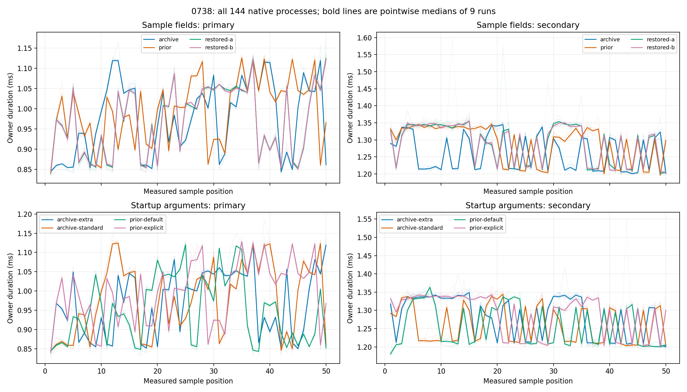

# 0738 — Sample fields and startup arguments

[Report](../../0738-ppt-sample-layout-and-startup-controls.md). Production is
unchanged. The main Sample restoration matrix and the subsequently planned argv
matrix are separately frozen, each containing 96 measured processes. Together:
7,200 native samples and 48 allocation samples. No samples are pooled across
phases. A redundant option changes same-binary secondary p50 by +6.14%; this
establishes startup sensitivity in these runs, not its unique mechanism or the
cause of the rejected 0735 candidate's regression.

## Evidence

- `plan.json`, `hypothesis.md`, `freeze.json`: main prospective contract.
- `argv-control/`: separate prospective plan, freeze, raw capture and analysis.
- `archive-probe`, `prior-probe`, `probe`: original, lifecycle and restored-field sources.
- `build-0` through `build-3`: complete attempts, including failed locked build.
- `qualification-*`, `negative-contract.json`: semantic and rejection checks.
- `captures`, `analysis.json`, `audit.json`: main raw observations and independent replay.
- `review.md`: frozen source review; `results-review.md`: later results review.
- `summary.txt`, `argv-control/summary.txt`, `threshold-flags.md`: all scalar results and flags.
- `source-equivalence.json`: exact original Sample definition and five function blocks.
- `cleanup.json`, `terminal.json`: six-binary identity cleanup and post-cleanup replay.
- `artifact-manifest.json`: exact packet inventory and SHA-256 hashes, excluding itself.



## Replay after cleanup

Run from the repository root. Saved-report replay does not require measurement
binaries or rebuilding production. The supplemental runner independently checks
scalar arithmetic; see the separate results review for raw grouping validation.

```sh
python3 -B docs/performance/results/change-0738/analyze.py
python3 -B docs/performance/results/change-0738/audit.py
python3 -B docs/performance/results/change-0738/negative-contract.py
python3 -B docs/performance/results/change-0738/source-equivalence.py
python3 -B docs/performance/results/change-0738/argv-control/run.py analyze
python3 -B docs/performance/results/change-0738/artifact-seal.py --check
```

Build manifests and capture manifests record exact historical commands and
binary identities. Owned target and binary directories have been removed.
`plot.py` can regenerate the visualization with Matplotlib; the sealed image is
the historical artifact, so regeneration may differ with rendering versions.
