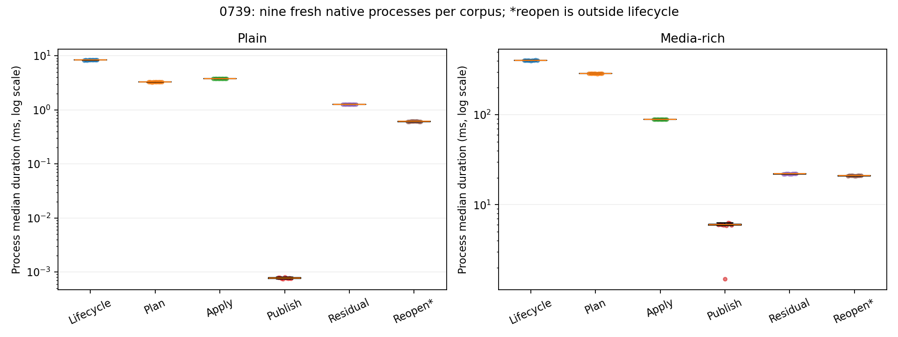

# 0739 — current PPTX cross-slide lifecycle baseline

This is an unchanged-source descriptive baseline for the existing owned plain
and media-rich cross-slide-copy lifecycle selectors. It is not a before/after
optimization, a historical timing comparison, or independent Office validation.
The 0735 rejection and 0738 PPT observer qualification prerequisite remain intact.

`plan.json` declares 18 native processes (540 samples) and six allocation
processes, alternating case order by repeat. Four qualification processes and
12 deliberately corrupted qualification reports precede capture. `freeze.json`
binds the capture/analyzer sources, source census, environment, declared plan,
qualified corpus/output projection and source review. `audit.py` independently
recomputes scalar statistics and grouping while sharing invocation and report
contract checks. Its receipt distinguishes that scope.

## Contents

- `source.json`, `workspace-inputs.json`, `constraints.json`: source and design binding;
  `workspace-Cargo.lock` retains the ignored root lockfile required by that guard.
- `build.py`, `build.json`, `build-*.log`, `environment.json`: exact build commands and environment.
- `hypothesis.md`, `decision-boundary.md`, `source-review.md`: rationale, scope and source proof.
- `qualification/`, `oracle.json`, `negative.py`, `negative.json`: admission and rejection controls.
- `captures/`, `capture.log`: every raw JSON report, stdout, stderr and command/timestamp/hash manifest.
- `analysis.json`, `audit.json`, `results-review.md`: statistics, threshold flags and independent review.
- `audit-negative.py`, `audit-negative.json`: four deliberate replay-corruption controls.
- `gates.json`, `gate-*.log`: three documentation/coverage structural checks.
- `plot.py`, `phase-medians.png`: all process medians by phase; reopen is outside lifecycle.
- `cleanup.json`, `terminal.json`: guarded binary cleanup and terminal verification.
- `artifact-manifest.json`: exact packet census and hashes, excluding itself.

## Offline replay

From the repository root, after owned binaries have been removed:

```sh
python3 -B docs/performance/results/change-0739/negative.py
python3 -B docs/performance/results/change-0739/analyze.py
python3 -B docs/performance/results/change-0739/audit.py
python3 -B docs/performance/results/change-0739/artifact-seal.py --check
```

Historical commands and executable identities are retained; capture is not an
offline replay command. Do not run `build.py` into this sealed packet: a new
measurement needs its own directory, executable identity and frozen invocation.
Source equality is checked against the current checkout for replay. A future
source change requires checking out the recorded base to satisfy that guard.
If the ignored root `Cargo.lock` is absent in a fresh checkout, restore it from
`workspace-Cargo.lock` before replay. The actual harness build uses the tracked
`tools/perf-baseline/Cargo.lock`.


