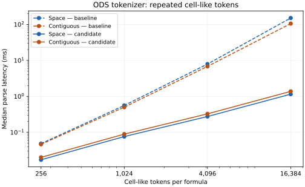

# ODS formula scan bounds and regression follow-up

The baseline is `5fae21a34`. The prior tokenizer review found quadratic
compatibility lookahead on space-separated cell-like tokens, and profiling
recorded long bracketed sheet-name and over-limit IRI regressions. This batch
addresses those measured production-readiness issues before the audit's remaining
expression grammar work.

The format owner remains `litchi-ods` (ADRs 0002/0023/0024). Token values, retained
formula text, finite limits, and typed allocation errors must remain unchanged
(ADRs 0001/0005/0006). A bounded immutable-input scan cache may remove repeated
work without allocating another index. Compiler hints are retained only where
measurements justify them. No expression evaluation or external access is added.

The parser stores the start/end offsets of the last legacy sheet-name run.
Later lookahead inside the same immutable run reuses its end. Both the compact
space-bearing-sheet check and the legacy cell parser use this cache. A backward
handoff can rescan a run once, while subsequent suffixes reuse the earlier start.
The existing 19-byte compact-name cap bounds speculative compact classification.
This eliminates the quadratic sheet lookahead in both spaced and contiguous
cell-like sequences without adding a heap allocation or enlarging token values.
The cache adds one `Option<(usize, usize)>` to the parser; a scan-work counter is
compiled only for tests.

A deterministic unit test counts scanned bytes for 1,024 spaced cells, contiguous
partial cells, ranges, absolute cells, and backward handoff. Six new public-API
regression groups preserve token values, dot-tail semantics, malformed suffix
refusals, absolute flags, and original prefixed formula text. The existing
allocation-failure regressions still pass.

The frozen source passed all five ODS gates: 822 tests across 49 targets, strict
Clippy, warning-denied rustdoc, doctests, and formatting. The workspace boundary
check passed for 65 packages and 241 internal dependency declarations, with its
existing migration debt explicitly reported. See [gates/results.json](gates/results.json)
and [gates/boundaries.log](gates/boundaries.log).

The annotation-removal A/B/A/B experiment found no useful recovery for long
bracketed sheet names; those production annotations remain unchanged. Final
comparative metrics are recorded in [performance/report.md](performance/report.md).
At 16,384 tokens, the spaced case falls from 150.95 ms to 1.15 ms (131×),
and the contiguous case from 105.57 ms to 1.38 ms (76.6×), with unchanged
allocation counts and requested/peak-live bytes. The ordinary 256-reference
lane measured +6.0% once and approximately +2.0% in a targeted A/B/A/B repeat;
both results are retained rather than treating the repeat as a replacement.

These are tokenizer measurements; no package CRUD, full expression grammar,
formula evaluation, or whole-parser memory complexity claim follows.

Run `python3 docs/report/spec-gap-validation-evidence/ods-formula-scan-performance/verify.py`
to verify the source-bound checks, raw metrics and retained artifact digests.
Temporary build outputs and executables are removed after evidence capture.
The [current audit disposition](audit-status.md) records completed ODS families
and distinguishes remaining lexical/evaluation requirements.
